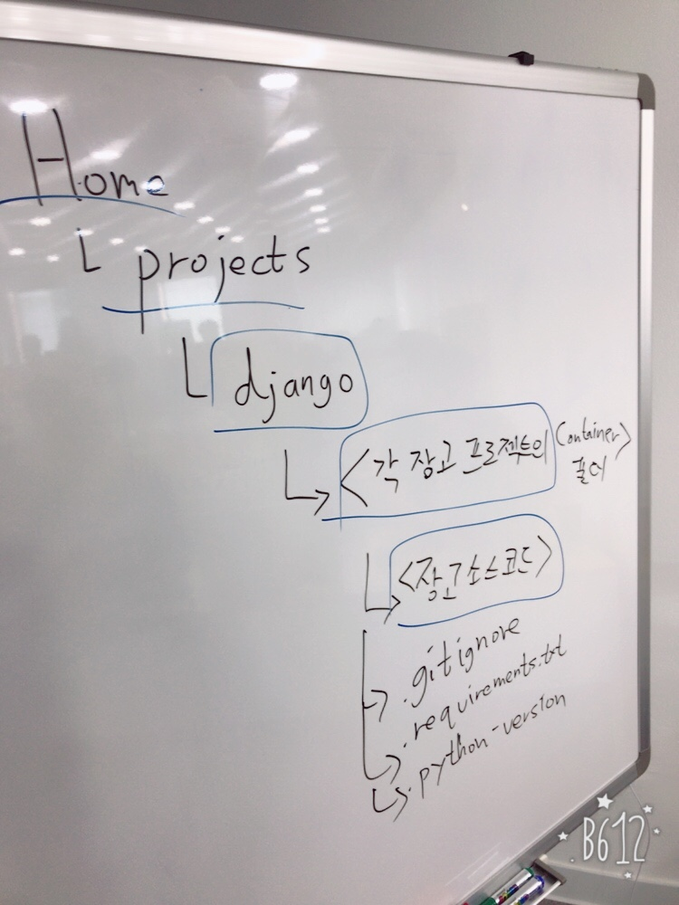

##NaverWebtoon Crawl

* crawl.py

```
# naver 패키지 내부의 NaverWebtoon클래스형 인스턴스를
# 생성 인스턴스에서  crawl_episode실행
from naver import *

# from naver import NaverWebtoonCrawler

webtoon_id = 183559
comics = NaverWebtoonCrawler(webtoon_id)
comics.crawl_episode(4)
```
* \_\_init\_\_.py

```
import os

import requests
from bs4 import BeautifulSoup


class NaverWebtoonCrawler:
    _url_detail_base = 'http://comic.naver.com/webtoon/detail.nhn?' \
                       'titleId={webtoon_id}&' \
                       'no={episode_num}&' \
                       'weekday=wed'

    def __init__(self, webtoon_id):
        self.webtoon_id = webtoon_id

    def crawl_page(self, page_num):
        return '해당 페이지의 에피소드 리스트'

    def crawl_episode(self, episode_num=None):
        """
        webtoon_id에 해당하는 웹툰의 episode_num과 내부의 이미지를 저장
        :param episode_num: 
        :return: 
        """
        dir_path = '{}/{}'.format(self.webtoon_id, episode_num)
        def make_episode_dir():
            # 이미지를 저장하기 위한 폴더 생성
            print(dir_path)
            # exists로 이미 생성하려는 폴더가 있는지 검사

            # 1번
            # if not os.path.exists(dir_path):
            #     os.makedirs(dir_path)
            #     print('dir created')
            # print('dir exist')

            # 2번
            # try~except구문으로 이미 폴더가 존재할경우 예외처리
            # try:
            #     os.makedirs(dir_path)
            # except FileExistsError as e:
            #     print('dir exist, error:', e)


            #3번
            # exist_ok매개변수 추가
            os.makedirs(dir_path, exist_ok=True)

        def get_img_tag_list():
            """
            디테일페이지에서 img Tag(bs4)의 리스트를 반환
            :return: 
            """
            # 디테일 페이지의 html을 가져와 img의 href를 출력
            # print(url_detail)
            # requests를 이용해서 url_detail에 get요청을 보냄
            response = requests.get(url_detail)
            # with open('test.html', 'wt') as f:
            #     f.write(response.text)
            # 응답(Response)에서 .text를 이용해 내용을 가져옴
            # 가져온 응답내용을 이용해 BeautifulSoup인스턴스를 생성 (soup)
            soup = BeautifulSoup(response.text, 'html.parser')
            # soup인스턴스에서 select_one메서드를 사용해 웹툰뷰어 태그를 리턴
            div_wt_viewer = soup.select_one('div.wt_viewer')
            # 웹튠뷰어 태그에서 img태그들을 전부 찾아 리스트로 반환
            img_list = div_wt_viewer.find_all('img')
            return img_list

        if not episode_num:
            url_detail = self._url_detail_base.format(
                self.webtoon_id,
                '마지막 에피소드 넘버 가져오기'
            )
        else:
            url_detail = self._url_detail_base.format(
                webtoon_id=self.webtoon_id,
                episode_num=episode_num
            )

        # 이미지를 다운받을 폴더 생성
        make_episode_dir()

        # 이미지 태그 목록 가져오기
        img_list = get_img_tag_list()

        # 리스트를 순회하며 각 img태그의 src속성을 출력 및 다운로드
        for index, img in enumerate(img_list):
            # 이미지 주소에 get요청
            print(img['src'])
            headers = {'Referer': url_detail}
            response = requests.get(img['src'], headers=headers)

            # 요청 결과 (이미지파일)의 binary데이터를 파일에 쓴다
            img_path = '{}/{:02}.jpg'.format(
                dir_path,
                index
            )
            with open(img_path, 'wb') as f:
                f.write(response.content)

        # 해당 에피소드를 볼 수 있는 HTML파일을 생성
        """
        <html>
            
            
            
            
        </html>
        """
        print('Crawling complete')

    def crawl_all_episodes(self):
        return ''


class NaverWebtoon:
    def __init__(self, webtoon_id):
        self.webtoon_id = webtoon_id
        self.episode_list = []

    def get_info(self):
        return '정보 리턴'

    def view_last_episode(self):
        return ''

    def view_episode_list(self, num=1):
        return ''

    def save_webtoon(self, create_html=False):
        if create_html:
            return '다운받은 웹툰을 볼 수 있는 html까지 생성해서 저장'
        return '특정 경로에 웹툰 전체를 다운받아서 저장'


class NaverWebtoonEpisode:
    # url_thumbnail, title, rating, date는 property로 구현 (전부 읽기전용, private으로 선언하지 말 것)
    def __init__(self, url_thumbnail, title, rating, date):
        self._url_thumbnail = url_thumbnail
        self._title = title
        self._rating = rating
        self._date = date

    @property
    def url_thumbnail(self):
        return self._url_thumbnail

    @property
    def title(self):
        return self._title

    @property
    def rating(self):
        return self._rating

    @property
    def date(self):
        return self._date
```


# Django

>Django Girls [Tutorial](https://tutorial.djangogirls.org/ko/)    
>Django Wiki [ko](https://ko.wikipedia.org/wiki/%EC%9E%A5%EA%B3%A0_(%EC%9B%B9_%ED%94%84%EB%A0%88%EC%9E%84%EC%9B%8C%ED%81%AC))  


장고(Django, FAQ 발음으로는 "쟁고"(IPA: [ˈdʒæŋgoː])[2])는 파이썬으로 작성된 오픈 소스 웹 애플리케이션 프레임워크로, 모델-뷰-컨트롤러 패턴을 느슨하게 적용한다. 2005년 7월에 BSD 사용 허가서로 공개되었다.

이 웹 애플리케이션 프레임워크는 집시 재즈 기타리스트인 장고 라인하르트의 이름을 따 명명되었다.

고도의 데이터베이스 기반 웹사이트를 작성하는 데 있어서 수고를 더는 것이 장고의 주된 목표이다. 장고는 **콤포넌트의 재사용성(reusability)**과 **플러그인화 가능성(pluggability)**, 빠른 개발 등을 강조하고 있다. 또한, "DRY(Don't repeat yourself: 중복배제)" 원리를 따랐다. 설정 파일 일서부터 데이터 모델에까지 파이썬 언어가 구석구석에 쓰였다


Django(/dʒæŋɡoʊ/ jang-goh/쟁고/장고)는 파이썬으로 만들어진 무료 오픈소스 웹 애플리케이션 프레임워크(web application framework)입니다. 쉽고 빠르게 웹사이트를 개발할 수 있도록 돕는 구성요소로 이루어진 웹 프레임워크랍니다.

웹사이트를 구축할 때, 비슷한 유형의 요소들이 항상 필요합니다. 회원가입, 로그인, 로그아웃과 같이 사용자 인증을 다루는 방법이 나 웹사이트의 관리자 패널, 폼, 파일 업로드와 같은 것들 말이지요.

그런데 정말 다행이게도, 오래전에 어떤 웹 개발자들이 새로운 웹 사이트를 개발할 때 서로 비슷한 문제들에 직면한다는 것을 깨달 았습니다. 그래서 팀을 조직했고요. 바로 사용할 수 있는 구성요소들을 갖춘 여러 프레임워크를 만들었답니다. 장고도 그중에 하나 인 거죠. 다시 발명해야 하는 문제로부터 해방감을 주고요. 새로운 웹사이트를 개발할 때 뒤따르는 간접비용의 부담을 덜어준답니 다.


##암호학
 **암호학**(暗號學, 영어: cryptography, cryptology)은 정보를 보호하기 위한 언어학적 및 수학적 방법론을 다루는 학문으로 수학을 중심으로 컴퓨터, 통신 등 여러 학문 분야에서 공동으로 연구, 개발되고 있다. 초기의 암호는 메시지 보안에 초점이 맞추어져 군사 또는 외교적 목적으로 사용되었지만, 현재는 메시지 보안이외에도 인증, 서명 등을 암호의 범주에 포함시켜 우리의 일상에서 떼 놓을 수 없는 중요한 분야가 되었다. 현금지급기의 사용, 컴퓨터의 패스워드, 전자상거래 등은 모두 현대적 의미의 암호에 의해 안정성을 보장받고 있다.

현대 암호학은 암호 시스템, 암호 분석, 인증 및 전자서명 등을 주요 분야로 포함한다.

### 용어설명
암호학을 이용하여 보호해야 할 메시지를 평문(平文, plaintext)이라고 하며, 평문을 암호학적 방법으로 변환한 것을 암호문(暗號文, ciphertext)이라고 한다. 이때 평문을 암호문으로 변환하는 과정을 암호화(暗號化, encryption)라고 하며, 암호문을 다시 평문으로 변환하는 과정을 복호화(復號化, decryption) 라고 한다.

암호학적 서비스가 제공하고자 하는 목표에는 다음과 같은 것이 있다.

1. **기밀성** (機密性, Confidentiality): 부적절한 노출 방지. 허가받은 사용자가 아니면 내용에 접근할 수 없어야 함.
2. **무결성** (無缺性, Integrity): 부적절한 변경 방지. 허가받은 사용자가 아니면 내용을 변경할 수 없어야 함.
3. **가용성** (可用性, Availability): 부적절한 서비스 거부 방지.
4. **부인봉쇄** (否認封鎖, Non-repudiation): 메시지를 전달하거나 전달받은 사람이 메시지를 전달하거나 전달받았다는 사실을 부인할 수 없어야 함.

### 암호학의 역사
암호학의 기원은 수천년 전부터 이뤄, 최근 수십 년까지의 기간을 일컫는다.역사상 기록으로 남은 가장 오래된 암호는 율리우스 카이사르가 사용한 대입암호이다. 고대 그리스에서 사용되던 스키테일 암호체계도 있다. 이 시기의 암호화 기법을 고전 암호학 이라 부르는데, 고전 암호학의 암호학 기법은 대체로 큰 차이가 없었다. 이런 고전 암호화 기법은 20세기 초에 이뤄서야 변화가 생겼는데, 이의 예로는 에니그마(독일어:Enigma 뜻:수수께기 )가 사용한 회전륜 가밀법이 대표적이다. 이후 전자요소와 계산기(컴퓨터)는 큰 발전을 이뤘으며, 이때 사용된 암호화 기법은 전통적인 사서통신에 쓰일 수 없게 되었다. 암호학의 발전은 암호분석학과 함께 발전했다. 즉 암호 편집과 가밀법에 대한 해독법을 말한다. 주로 가밀된 신호의 빈율을 분석하여 해석했는데, 이런 방법을 응용하여 해석된 암호문은때때로 역사를 바꾸기도 했다.예를 들어,치머만 전보를 해석한 것은 미국이 1차 세계대전에 참전하게 되는 계기가 되었고,동맹국이 나치의 암호문을 해석한 것은 2차세계대전의 기간을 2년정도 단축시켜 주기도 하였다. 20세기부터 70년대 이전에 암호학의 대부분은 정부의 안전범주에 속했지만, 공개표준키 체제의 탄생과 공개키 가밀법의 발명은 암호학을 대중영역에 접하게 하였다

-

### 대칭키 암호 시스템
암호문을 생성(암호화)할 때 사용하는 키와 암호문으로부터 평문을 복원(복호화)할 때 사용하는 키가 동일한 암호 시스템이다. 암호 시스템의 안전성은 키의 길이, 키의 안전한 관리에 상대적으로 의존성이 높다. 암호문의 작성자와 이의 수신자가 동일한 키를 비밀리에 관리해야 하므로 폐쇄적인 특성을 갖는 사용자 그룹에 적합한 암호 시스템이다. 냉전시절 워싱턴과 모스크바 사이의 핫라인(hot line)에 적용되었던 OTP(one time pad)는 대칭키 암호 시스템의 예이다.

#### 암호화 및 복호화
엘리스(Alice)가 밥(Bob)에게 암호문을 보내고 복호화하는 가장 기본적인 과정을 기술한다. 엘리스와 밥은 같은 키를 공유하고 있어야 한다. 엘리스는 공유한 키로 암호화를 하며, 밥은 같은 키로 이를 복호화한다. 보통 복호화 과정은 암호화 과정의 역과정이다. 암호화와 복호화에 사용된 키가 같지 않더라도 한 키로부터 다른 키를 쉽게 얻을 수 있는 경우에는 대칭키 암호 시스템의 범주에 넣는다.

-

### 공개키 암호 시스템
대칭키 암호 시스템의 가장 큰 약점은 키관리의 어려움에 있다. 한 사용자가 관리해야 할 키의 수가 너무 많아지기 때문이다. 이러한 약점을 보완하기 위해 나타난 암호 시스템이 공개키 암호 시스템이다. 공개키 암호 시스템에서 각 사용자는 두 개의 키를 부여 받는다. 그 하나는 공개되고(공개키, public key), 다른 하나는 사용자에 의해 비밀리에 관리 되어야 한다.(비밀키, private key) 공개키 암호 시스템에서 각 사용자는 자신의 비밀키만 관리하면 되므로 키 관리의 어려움을 줄일 수 있다. 공개키 암호 시스템에서는 각 사용자의 공개키를 관리하는 공개키 관리 시스템(공개키 디렉터리)이 필요하며 각 사용자는 이 시스템에 자유롭게 접근하여 다른 사용자의 공개키를 열람할 수 있어야 한다.

공개키 암호 시스템은 두 키의 수학적 특성에 기반하기 때문에, 메시지를 암호화 및 복호화 하는 과정에 여러 단계의 산술 연산이 들어간다. 따라서 대칭키 암호 시스템에 비하여 속도가 매우 느리다는 단점을 지니고 있다.

#### 암호화 및 복호화
엘리스(Alice)가 밥(Bob)에게 암호문을 보내고 복호화하는 가장 기본적인 과정을 기술한다. 두 사용자에게는 각각 공개키와 비밀키가 부여되었고, 이들의 공개키는 공개키 디렉터리에 저장되어 있다. 엘리스는 공개키 디렉터리에서 밥의 공개키를 찾아 이를 이용하여 문서를 암호화하여 밥에게 보낸다. 밥은 수신한 비밀 문서를 자신만이 알고 있는 자신의 비밀키로 복호화하여 엘리스가 보낸 문서의 내용을 알 수 있다. 공개키 만으로는 복호화가 불가능하기 때문에, 엘리스 역시 암호화 하고 나서 복원할 수 없다는 특징이 있다.

공개키 암호 시스템에서 암호화-복호화 시스템은 두 키가 짝으로 동작하기 때문에, 비밀키로 암호화 하고 공개키로 복호화 할 수도 있다. 이 방법을 이용하면 해당 공개키에 맞는 비밀키 보유자를 확인 할 수 있으며, 전자서명에서는 이런 성질을 이용한다.

이와 같이 공개키 암호 시스템에서는 암호화할 때 사용되는 키와 복호화할 때 사용되는 키가 다르기 때문에 비대칭 암호 시스템이라고 부르기도 한다.

#### 공개키와 비밀키의 관계
공개키 암호 시스템에서 각 사용자에게 부여되는 공개키와 비밀키에는 수학적 연관이 있기 때문에 암호화와 복호화가 가능하다. 이 둘은 마치 두 조각으로 나뉜 유리 조각과 같다. 한쪽은 공개되어 있고 그에 맞는 다른 한쪽은 감추어져 있는 것이다. 그러나 이들은 본래의 모습을 감추고 있다. 한쪽이 그대로 공개된다면 숨겨진 다른 한쪽의 모습도 알려질 수 있기 때문이다. 원래의 모습을 감추고 또 원래의 모습으로 되돌리는 과정에서 수학이 중요한 역할을 한다.

#### 공개키 암소 시스템의 종류
다음은 잘 알려진 공개키 암호 시스템의 예이다. 이들은 각각이 갖는 알고리즘과 키 생성상의 특성을 갖는다. 이것은 처리 속도, 구현의 편의성과 연관이 되어 응용되는 분야를 결정하게 된다.

* [RSA](https://ko.wikipedia.org/wiki/RSA_%EC%95%94%ED%98%B8)

	>RSA는 공개키 암호시스템의 하나로, 암호화뿐만 아니라 전자서명이 가능한 최초의 알고리즘으로 알려져 있다. RSA가 갖는 전자서명 기능은 인증을 요구하는 전자 상거래 등에 RSA의 광범위한 활용을 가능하게 하였다.

-

### 시큐어 셸
[시큐어 셸(Secure Shell, SSH)](https://ko.wikipedia.org/wiki/%EC%8B%9C%ED%81%90%EC%96%B4_%EC%85%B8)은 네트워크 상의 다른 컴퓨터에 로그인하거나 원격 시스템에서 명령을 실행하고 다른 시스템으로 파일을 복사할 수 있도록 해 주는 응용 프로그램 또는 그 프로토콜을 가리킨다. 기존의 rsh, rlogin, 텔넷 등을 대체하기 위해 설계되었으며, 강력한 인증 방법 및 안전하지 못한 네트워크에서 안전하게 통신을 할 수 있는 기능을 제공한다. 기본적으로는 22번 포트를 사용한다.

SSH는 암호화 기법을 사용하기 때문에, 통신이 노출된다 하더라도 이해할 수 없는 암호화된 문자로 보인다.


#### 주요기능
* 보안 접속을 통한 rsh, rcp, rlogin, rexec, telnet, ftp 등을 제공.
* IP spoofing (IP스푸핑, 아이피 위/변조 기법중 하나)을 방지하기 위한 기능을 제공.
* X11 패킷 포워딩 및 일반적인 TCP/IP 패킷 포워딩을 제공.


## Django 설치

* 프로젝트 폴더와 장고의 폴더는 따로 **분리하여 작업**한다.
* **~/projects/django/djangogirls/**
	* `>> pyenv virtualenv 3.5.3 djangogirls_env`
	* `>> pyenv local djangogirls_env`
	* `>> pip list`
	* `>> python --version`
	* `>> pip install django`
	* `>> pip install django --upgrade`


일반적으로 controller라고 부르는 것을 장고에서는 함수(view)라고 부르며
일반적으로 view라고 부르는 것을 장고에서는 template이라 한다.


## [GitHup SSH key](https://git-scm.com/book/ko/v1/Git-%EC%84%9C%EB%B2%84-SSH-%EA%B3%B5%EA%B0%9C%ED%82%A4-%EB%A7%8C%EB%93%A4%EA%B8%B0)
>SSH KEY설정을 해 두면 push할 때마다 물어보는 비밀번호입력 단계를 생략할 수 있다.

* `mkdir .ssh`
* 공개키 설정
	* `ssh-keygen -t rsa -b 4096 -C "your_email@example.com"`
* 공개키 보기
	* `cat id_rsa.pub`
* GIT SSH 설정
	* settings -> SSH and GPG keys -> New SSH Key > 에 위의 공개키 붙여넣기
* Git 폴더의 SSH 주소 복사

## djangogirls 작업폴더 Git 설정
 
* `git init`
* `git remote add origin [복사한 SSH 주소: git@github.com:YunsikPark/DjangoGirls-Tutorial.git]`
* `git remote -v` 

## django 설정

* `djangogirls(작업폴더)>> django-admin startproject mysite`

* 위와 같이 하면 mysite 폴더 안에 mysite라는 폴더가 똑같이 생기는데 상위 mysite폴더의 이름을 바꿔준다.
	* mv mysite django_app

* 장고 트리보기
	* `tree django`
	


## gitignore.io
* [https://www.gitignore.io/](https://www.gitignore.io/)
* .gitignore 파일을 자동으로 만들어준다.
	* 우리가 자주 쓰는 프로그램들을 입력해서 자동으로 생성
	* `macOS`, `Django`,`Python`,`PyCharm`등..
* `vi .gitignore` 파일을 djangogirls폴더에 생성후 붙여넣기한다.
* 그리고 제일 상단에 다음과 같이 입력한다.

```
### Custom ###
.idea
*.swp

```
* `git add -A`
* `git commit`
* `git commit -m 'First Commit'`
* `git push origin master`


---

## 로컬에서 장고 서버 열기

>`manage.py`
는 스크립트인데, 사이트 관리를 도와주는 역할을 합니다. 이 스크립트로 다른 설치 작업 없이, 컴퓨터에서 웹 서버를 시작할 수 있습니다.


>`settings.py` 는 웹사이트 설정이 있는 파일입니다.


* django_app(작업폴더)>>에서
* `./manage.py`를 입력해보면 장고에서 쓸 수 있는 명령어 들이 나온다.


* 로컬에서 장고 서버 실행
	* `./manage.py runserver`
	* 인터넷 브라우저에서 `127.0.0.1:8000` 실행
	* `Ctrl + C` 장고 빠져나오기


